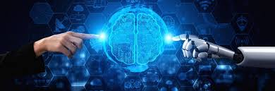

# Proyecto-IA-Andres-Guancha
Resumen sobre que es la Inteligencia Artificial
<h1 align="center">Inteligencia Artificial</h1>

## ¿Qué es la Inteligencia Artificial?

La Inteligencia Artificial (IA) es la ciencia y la ingeniería que busca crear máquinas inteligentes. Estas máquinas, como computadoras o robots, pueden realizar tareas que normalmente asociamos con seres inteligentes, como aprender, razonar o autocorregirse. En resumen, la IA emula la inteligencia humana mediante algoritmos y sistemas especializados

### ***Componentes de la IA***

 1.	**Aprendizaje Automático (Machine Learning):** Es un subcampo de la IA que permite a las máquinas aprender de datos sin ser programadas explícitamente. Utiliza algoritmos para mejorar su rendimiento con la experiencia.
2.	**Procesamiento del Lenguaje Natural (Natural Language Processing):** Se enfoca en la interacción entre las computadoras y el lenguaje humano. Permite a las máquinas comprender, generar y responder al lenguaje humano de manera natural.
3.	**Visión por Computadora (Computer Vision):** Este campo se ocupa de enseñar a las máquinas a interpretar imágenes y videos. Permite que las computadoras “vean” y extraigan información visual.
4.	**Robótica:** La robótica en la IA se refiere a la creación de robots o sistemas automatizados que pueden realizar tareas físicas. Combina la percepción (visión, sensores) con la acción (movimiento, manipulación).
5.	**Redes Neuronales (Neural Networks):** Estas son estructuras inspiradas en el cerebro humano.


## Enlaces

[Google](https://www.canalinnova.com)
[Google](https://www.elementosonline.com)
[Google](https://es.wikipedia.org/wiki/Inteligencia_artificia)
[Bing](https://www.ibm.com/mx-es/topics/artificial-intelligence)

```markdown
[Google](https://www.canalinnova.com)
[Google](https://www.elementosonline.com)
[Google](https://es.wikipedia.org/wiki/Inteligencia_artificial)
[Bing](https://www.ibm.com/mx-es/topics/artificial-intelligence)
```
## **Imagen de IA**

<p align="center">
                        
=======
                        
</p>

### ***Sintesis de la IA*** 
`La inteligencia artificial es como un espejo que refleja la creatividad y el conocimiento de sus creadores, pero también revela la complejidad y los misterios del universo`

```python
def Bienvenida_IA():
    print("Bienvenido a la IA")
```
### **Cuadro Comparativo de las diferentes IA**

| Tipo de IA          |      Ejemplos          | 
|---------------------|------------------------|
| IA Estrecha          |      Chatbots          |
| IA General           |   Aprendizaje autónomo           |
|IA Súper Inteligente          | Creacion de Tecnologia   | 


## Citas sobre IA
>1. **Stephen Hawking**: "La inteligencia artificial no es el futuro, es el presente." ².
>2. **Elon Musk**: "La inteligencia artificial es el único camino para la supervivencia de la humanidad." ².
>3. **Ray Kurzweil**: "La inteligencia artificial nos hará más humanos." ².


